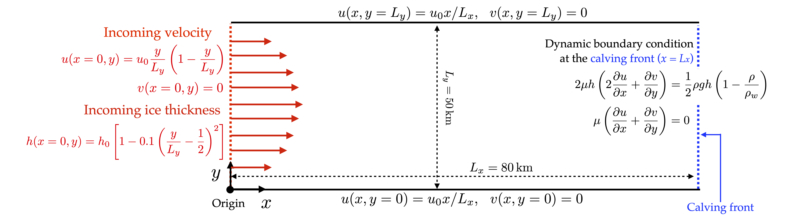

[](https://colab.research.google.com/github/YaoGroup/DIFFICE_jax/blob/main/tutorial/pinn_syndata.ipynb)

# Tutorial example for viscosity inversion

This folder provides a tutorial example to infer the effective viscosity $\mu$ of ice shelves 
from synthentic data of ice velocity and thickness via physics-informed neural networks (PINNs).
Both of the simulation code for synthetic-data generation and the PINN code for viscosity
inversion are provided in this folder. All codes are well-documented for easy understanding.
In addition, we provided the ipynb file that allows the user to run the code in the Google 
Colab online.

## Forward problem setup
Considering the floating ice moving in a given domain, the synthetic data of ice
velocity and thickness data can be calculated by solving the Shallow-shelf Approximation (SSA)
equations and steady mass conservation equation numerically with a given viscosity, which read

$$\begin{array}{l}
\displaystyle \frac{\partial} {\partial x}\left(4 \mu h \frac{\partial  u}{\partial x} + 2\mu h \frac{\partial  v}{\partial y}  \right) 
	+ \frac{\partial} {\partial y} \left( \mu h\frac{\partial  u}{\partial y} + \mu h\frac{\partial v}{\partial x}  \right)  
= \rho g \left(1-\frac{\rho}{\rho_w}\right)h\frac{\partial h}{\partial x} \qquad \text{(SSA)} \cr
\displaystyle  \frac{\partial} {\partial x} \left(\mu h\frac{\partial  u}{\partial y} + \mu h\frac{\partial v}{\partial x} \right)
	+ \frac{\partial} {\partial y} \left( 2\mu h\frac{\partial u}{\partial x} + 4 \mu h\frac{\partial v}{\partial y} \right)  
= \rho g \left(1-\frac{\rho}{\rho_w}\right)h\frac{\partial h}{\partial y} \qquad \text{(SSA)} \cr
\end{array}$$

$$ \qquad \nabla \cdot (hu) = \frac{\partial (hu)} {\partial x} + \frac{\partial (hv)} {\partial y} = \dot{a} - \dot{b} \qquad \qquad \text{(Steady mass conserv.)} $$

where $(u, v)$, $h$ and $\mu$ are the velocity vector, thickness and viscosity of the floating 
ice, respectively. $\dot{a}$ and $\dot{b}$ are the snow accumulation rate and basel melting rate,
respectively. For the tutorial example provided in this folder, we consider the floating 
ice moving in a confined rectangular channel. For simplicity, we assume that both $\dot{a}$ and $\dot{b}$
are equal to 0. The domain size and the associated boundary conditions for the ice flow are listed 
in the figure below. To make the example close to the actual ice-shelf flow, we set the velocity 
scale to be $u_0 = 1$ $\mathrm{km/yr}$ $= 3.17 \times 10^{-5}$ $\mathrm{m/s}$ and the thickness 
scale to be $h_0 = 500$ $\mathrm{m}$.

<p align="center">
    
</p>

Besides the governing equations and the boundary condition, a **known** viscosity profile $\mu(x,y)$ 
is required to generate the synthetic data of ice velocity and thickness. For the tutorial example,
the viscosity profile is given as


$$ \begin{equation}
  \mu(x,y) = \mu_0 \left[1-\frac{1}{2} \cos \left(2\pi \frac{y}{L_y}\right)\right] \left(\frac{2}{3} + \frac{x}{3L_x}\right)
\end{equation} $$

where we set the viscosity scale to be $\mu_0 = 5 \times 10^{13}$ (Pa $\cdot$ s) to match the 
magnitude of actual ice-shelf viscosity. Now, we have all the information to generate the 
synthetic data by solving the govnering equation numerically. For the sake of simplicity, we 
solve the equations using the **COMSOL multiphysics**, which provides a good user interface to 
set the forward problem and conduct the calculation. 

## Code description
### `IceShelf2D_forward.mph`  in the `COMSOL` folder

The COMSOL file `.mph` in the `COMSOL` folder solves the governing equations with the boundary 
conditions and given viscosity as described above. Users need to have the basic COMSOL software 
(no extra Module required) with version >= 5.6 to open the file. Users are free to change the 
domain size, geometry, boundary conditions, and given viscosity profile in the COMSOL file to 
create different synthetic data. The provided COMSOL file can export the synthetic data in a `.txt` 
format by default. The `SynData_exp1.txt` is the data file exported from the current COMSOL file.


### `txt2mat.m`

A MATLAB script that converts the raw data file (`.txt`) exported from COMSOL into MATLAB data 
format (`.mat`). The synthetic data are organized in the way that is required to be loaded into
the python code for PINN training. The `SynData_exp1.mat` is the MATLAB data file converted from
the current `SynData_exp1.txt` raw data file in the `COMSOL` folder. We note that ehe MATLAB data 
format (`.mat`) is convenient for the user to observe the synthetic data in MATLAB via the commend

```matlab
load('SynData_exp1.mat')
figure; surf(Xq, Yq, uq);  % surface plot of the velocity component u
shading interp;
```


### `load_syndata.py`

A python script that normalizes the synthetic data loaded from the MATLAB format (`.mat`). The script
will automatically find the characterisitc scale of each variable in the synthetic data, including 
spatial coordiates $(x,y)$, velocity $(u, v)$ and thickness $h$, and normalize them to be within
$[-1, 1]$. The script also re-organizes and reshapes the data to meet the requirement for the PINN
training. 


### `pinn_syndata.py`

The main python script that conducts the PINN training to infer ice viscosity from the synthetic data.
The script is used to run on a local machine. The user should select the synthetic data file and set 
the hyper-parameters for the training. After the training, the script will automatically save the trained
network weights and biases in the `.pkl' format, and the prediction of solution and equation residue at
high-resolution grids in the `.mat' format. Both files will be stored in the `Results` subfolder. The 
current setting of hyper-parameters allows the viscosity inversion from the example data `SynData_exp1.mat`
to reach high accuracy.


### `pinn_syndata.ipynb`
The Colab notebook, similar to the script `pinn_syndata.py` that can conduct the PINN training to infer ice 
viscosity from the synthetic data. The user can run the notebook directly in Google Colab online without any 
need to install python environments and library on a local machine. Different from the script `pinn_syndata.py`,
after the training, the notebook plots the trained networks for the data assimilation and viscosity 
inversion, and compare them directly with the synthetic data and the given viscosity profile.

## Results

The figure below shows the trained results of PINNs for the synthetic data provided in this folder. The 
trained networks for ice velocity and thickness match well with the synthetic data and the inferred 
viscosity shows a good agreement with the given viscosity profile with the relative error lower than 1%.
This trained results is obtained after 100k iterations of Adams, followed by another 100K iterations of
L-BFGS.

<p align="center">
    
</p>
